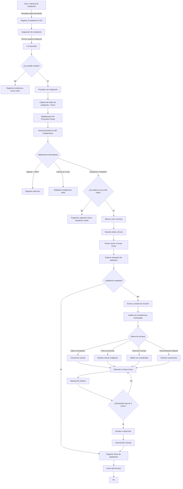

```mermaid
flowchart TD
    A[Inicio: Solicitud de Instalación] -->|Recopilar datos del cliente| B[Registro en plataforma TAC]
    B --> C[Asignación de Instalación]
    C -->|Técnico acepta instalación| D[ir al domicilio]
    D --> E{¿Es posible instalar?}
    E -- No --> F[Registrar incidencia y cerrar orden]
    E -- Sí --> G[Proceder con instalación]
    G --> H[Captura de Datos de Instalación - Físico]
    H --> I[Digitalización del Formulario Virtual]
    I --> J[Almacenamiento en BD Instalaciones]
    J --> K{Validaciones Automáticas}
    K -- Bajante > 300m --> L[Registrar dirección]
    K -- Cálculo de Costo --> M[Multiplicar longitud por tarifa]
    K -- Instalación Completa? --> N{¿Se realizó en una sola visita?}
    N -- No --> O[Programar segunda visita y actualizar conteo]
    N -- Sí --> P[Marcar como Correcta]
    P --> Q[Exportar datos a Excel]
    Q --> R[Enviar correo a Grupo Carso]
    R --> S[Esperar respuesta de validación]
    S --> T{¿Validación aceptada?}
    T -- Sí --> U[Registrar fecha de liquidación]
    T -- No --> V[Enviar a módulo de revisión]
    V --> W[Análisis de instalaciones rechazadas]
    W --> X{Motivo de rechazo}
    X -- Datos incompletos --> Y[Corrección manual]
    X -- Fotos incorrectas --> Z[Solicitar nuevas imágenes]
    X -- Dirección errónea --> AA[Validar con coordinador]
    X -- Documentación faltante --> BB[Solicitar nuevamente]
    Y --> CC[Reenviar a Grupo Carso]
    Z --> CC
    AA --> CC
    BB --> CC
    CC --> DD[Historial de intentos]
    DD --> EE{¿Rechazada más de 3 veces?}
    EE -- Sí --> FF[Escalar a supervisor]
    EE -- No --> CC
    FF --> GG[Intervención manual]
    GG --> U
    U --> HH[Cierre del Proceso]
    HH --> II[Fin]
```
