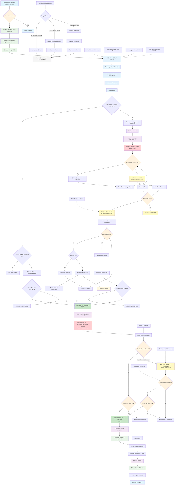

```mermaid
flowchart TD
    A[Inicio - Venta por Redes Sociales/Farmacia] --> B{Cliente Interesado?}
    
    B -->|Sí| C[Vendedor Captura Orden de Venta]
    B -->|No| D[Fin del Proceso]
    
    C --> E[Ingresar Información en App Canales Externos]
    E --> F[Generar SIAC_CODE]
    
    F --> G[📧 Email con ZIP del Reporte]
    G --> H[Descompresión del Archivo]
    H --> I[📊 Acceso a Diario de Ventas Excel]
    I --> J[Saltarse el Resumen]
    J --> K[Acceso Detail]
    
    K --> L{SIAC_CODE existe en MEXPROD?}
    L -->|Sí| M{Estado Anterior != Estado DV?}
    M -->|No| N[Skip - Sin Cambios]
    M -->|Sí| O[Actualizar Estado a incoming_state]
    
    L -->|No| P[Crear Nuevo Registro en MEXPROD]
    P --> Q[Crear Customer]
    Q --> R[Crear Contract con SIAC_CODE]
    R --> S[ESTADO: 1. PENDIENTE<br/>Faltan datos]
    
    S --> T{Documentación Completa?}
    T -->|No| U[Solicitar Documentos Faltantes]
    U --> V[Crear Tarea de Seguimiento]
    V --> T
    T -->|Sí| W[ESTADO: 2. ABIERTA<br/>Proceso de instalación]
    
    W --> X[Iniciar Timer 72 horas]
    X --> Y{Timer > 72 horas?}
    Y -->|Sí| Z[ESTADO: 3. LLAMADA<br/>+72 horas en ABIERTA]
    Y -->|No| AA[Continuar en ABIERTA]
    
    Z --> BB[Programar Llamada Verificación]
    BB --> CC{Llamada Exitosa?}
    CC -->|No| DD{Intentos < 3?}
    DD -->|Sí| EE[Reagendar Llamada]
    EE --> FF[Actualizar Contador]
    FF --> CC
    DD -->|No| GG[Escalar a Supervisor]
    GG --> HH[Marcar como No Contactado]
    
    CC -->|Sí| II[Validar Datos Cliente]
    II --> JJ[Comparar Estados DV]
    JJ --> KK{Estado DV = POSTEADA?}
    KK -->|No| LL[Mantener Estado Actual]
    KK -->|Sí| MM[ESTADO: 4. POSTEADA<br/>PF, TL]
    
    O --> NN{Nuevo Estado = POSTEADA?}
    NN -->|Sí| MM
    NN -->|No| OO[Actualizar a Nuevo Estado]
    
    MM --> PP[Crear Order vinculada a Contract]
    PP --> QQ[ESTADO ORDER: 1. TÉCNICO ENTREGA MODEM<br/>Posteo e instalación ok]
    
    QQ --> RR[Iniciar Timer 2 Semanas]
    RR --> SS{Cambio de Estado en DV?}
    SS -->|Sí| TT{first_invoice_paid == 1?}
    TT -->|Sí| UU[ESTADO ORDER: 3. PAGADA<br/>PF, TL]
    TT -->|No| VV[Mantener Estado Actual]
    
    SS -->|No - Timer > 2 Semanas| WW[ESTADO ORDER: 2. COBRANZA<br/>+2 SEMANAS T.E.M]
    
    WW --> XX{Nueva Importación DV?}
    XX -->|Sí| YY{first_invoice_paid == 1?}
    YY -->|Sí| UU
    YY -->|No| ZZ[Mantener en COBRANZA]
    XX -->|No| ZZ
    
    UU --> AAA[Calcular Comisión Promotor]
    AAA --> BBB[Notificar Promotor y Coordinador]
    BBB --> CCC[Crear Registro Auditoría]
    CCC --> DDD[Enviar Confirmación Cliente]
    DDD --> EEE[Generar Factura]
    EEE --> FFF[Activar Servicio Definitivo]
    
    FFF --> GGG[Crear Registro Analytics]
    GGG --> HHH[Proceso Completo ✓]
    
    %% Procesos de Cancelación
    III[Cliente Solicita Cancelación] --> JJJ{En qué Estado?}
    JJJ -->|PENDIENTE/ABIERTA| KKK[Cancelar sin Costo]
    JJJ -->|LLAMADA/POSTEADA| LLL[Aplicar Política Cancelación]
    JJJ -->|ORDEN CREADA| MMM[Proceso Devolución]
    
    KKK --> NNN[Marcar Contract como CANCELADO]
    LLL --> OOO[Evaluar Penalizaciones]
    OOO --> NNN
    MMM --> PPP[Reversar Comisiones]
    PPP --> QQQ[Proceso Reembolso]
    QQQ --> NNN
    
    %% Procesos de Error y Recuperación
    GG --> RRR[Log Error Contacto]
    
    %% Procesos Paralelos de Monitoreo
    SSS[Monitor 72hrs] -.-> Y
    TTT[Monitor 2 Semanas] -.-> RR
    UUU[Health Check DV Import] -.-> G
    VVV[Audit Logger] -.-> CCC
    
    %% Alertas Automáticas por Email
    WWW[Proceso Automático Email DV] -.-> G
    XXX[Alerta Contract > 72hrs] -.-> Z
    YYY[Alerta Order > 2 Semanas] -.-> WW
    ZZZ[Alerta Pagos Pendientes] -.-> XX
    
    %% Proceso de Importación Diario de Ventas
    AAAA[📧 Recepción Email Diario] --> G
    BBBB[🔄 Proceso Automático cada X horas] -.-> G
    
    %% Estilos por Estado
    classDef startEnd fill:#e1f5fe
    classDef external fill:#e8f5e8
    classDef pendiente fill:#ffcdd2
    classDef abierta fill:#fff9c4
    classDef llamada fill:#fff9c4
    classDef posteada fill:#c8e6c8
    classDef tecnico fill:#ffcdd2
    classDef cobranza fill:#fff9c4
    classDef pagada fill:#c8e6c8
    classDef process fill:#f3e5f5
    classDef decision fill:#fff3e0
    classDef success fill:#e8f5e8
    classDef warning fill:#fff8e1
    classDef cancelado fill:#f5f5f5
    classDef email fill:#e3f2fd
    
    class A,D,HHH startEnd
    class C,E,F external
    class S pendiente
    class W,AA abierta
    class Z llamada
    class MM posteada
    class QQ tecnico
    class WW cobranza
    class UU pagada
    class Q,R,PP,AAA,EEE process
    class B,T,Y,CC,SS,TT,XX,YY decision
    class RRR warning
    class FFF,BBB success
    class NNN cancelado
    class G,H,I,J,K email
```
